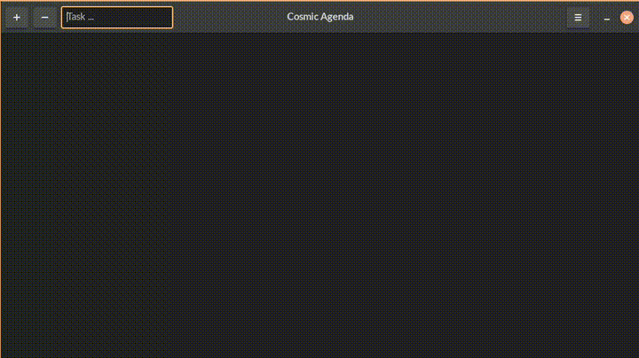
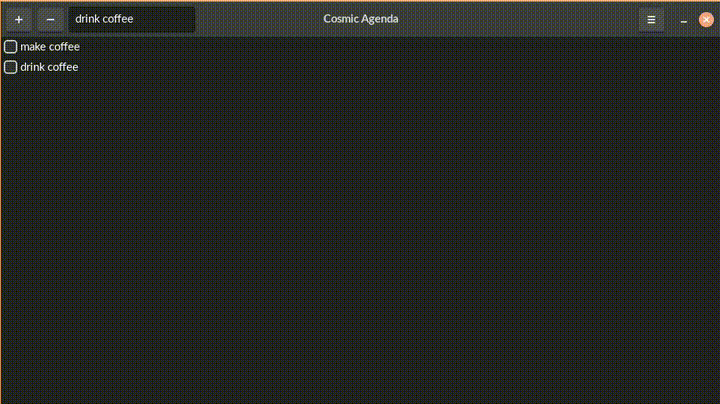

# Cosmic Agenda

A simple gtk4 application to track your todo list.


## Installation

```
git clone https://github.com/wilbura009/gtk4_playground.git
```

## Usage

Compile

```
cd gtk4_playground/proj/cosmicagenda/ && make
```

Execute

```
./cosmicagenda
```

## Features

| Feature | Preview |
| ---     | :---:     |
| Add Items |  |
| Remove Items |   |

## Additional Tools

- [cambalache](https://gitlab.gnome.org/jpu/cambalache) - used to create prototypes.
- [Devhelp](https://wiki.gnome.org/Apps/Devhelp) - used to get quick info about API.
